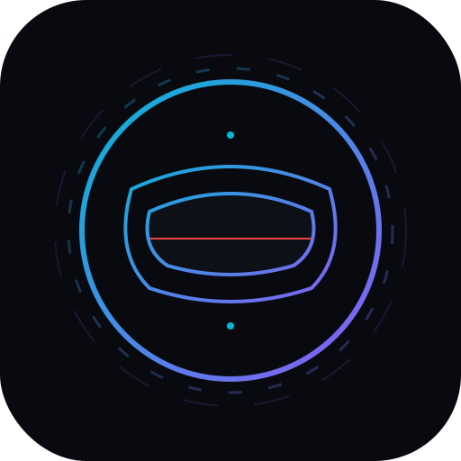
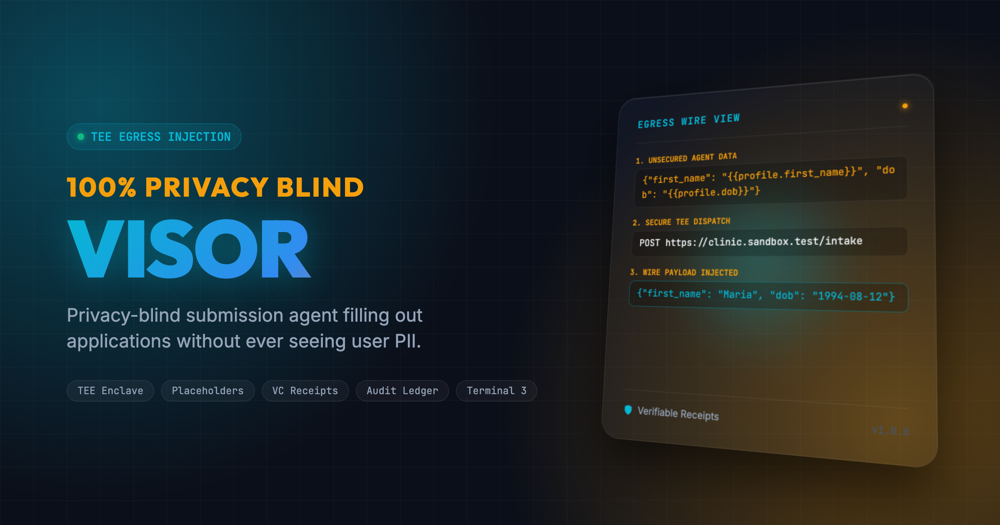
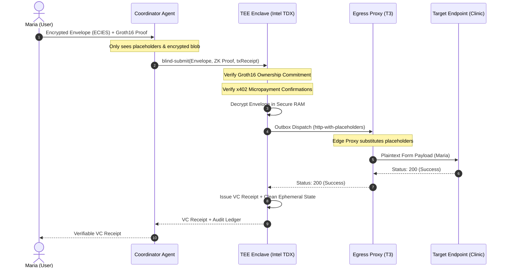

<div align="center">

  
  <h1>Visor 🥽</h1>
  <p><em>Your Agent Acts. It Never Sees You. Privacy-Blind Egress Gateway inside TEEs.</em></p>
  

  <br/>

  [](https://visor.edycu.dev)
  [](https://youtu.be/your-video)
  [](docs/PITCH_DECK.md)
  [](https://dorahacks.io/hackathon/t3adkdevchallenge)

  <br/>

  
  
  
  
  
  
  
  
  
  
  
  [](https://github.com/edycutjong/visor/actions/workflows/ci.yml)

</div>

---

> ⚡ **Reviewers / judges:** fastest path is **[GOLDEN_PATH.md](GOLDEN_PATH.md)** — the entire flow in ~2 minutes, **no credentials**. Bug-bounty track: **[SDK_AUDIT.md](SDK_AUDIT.md)** (confirmed, code-cited findings from the real `@terminal3` SDK).

## 📸 See it in Action

<div align="center">
  
</div>

> **How the blind-egress workflow functions:** 
> 1. The user encrypts their PII locally into an ECIES envelope. 
> 2. The unsecure AI agent (LLM/Coordinator) schedules forms using secure placeholders (`{{profile.dob}}`). 
> 3. The secure TEE decrypts, swaps placeholders, and dispatches plaintext egress directly at the boundary proxy wire.

---

## 💡 The Problem & Solution

AI agents are increasingly deployed to automate administrative and scheduling tasks, like booking medical appointments or submitting job applications. However, to complete these forms, the agent requires the user's plain-text Personally Identifiable Information (PII), such as full name, date of birth, SSN, and email. Storing or feeding this data into unsecure LLM contexts or coordinator databases risks massive PII leakage.

**Visor** solves this by leveraging **Intel SGX/TDX TEE Hardware Enclaves** running CCF (Confidential Consortium Framework). Users encrypt their PII locally. Unsecure coordinator agents execute tasks using cryptographic placeholder variables. Plaintext parameters are only reconstructed and injected at the network edge inside the secure enclave during out-of-band egress, keeping the data completely blind to the unsecure host context.

**Key Features:**
- 🔒 **Egress Proxy Isolation**: Decrypted user attributes are processed strictly inside the enclave's memory boundary and never persisted, logged, or exposed to the untrusted host coordinator.
- 📺 **Split-Screen Telemetry**: Side-by-side view comparing the unsecure agent context (placeholders) and the TEE-hydrated egress wire.
- 📜 **Verifiable VC Receipts**: Enclave issues ECDSA-signed Verifiable Credentials confirming successful execution.
- 🗄️ **Append-Only Audits**: Tracks template states and lifecycle events securely inside the enclave's KV store.

---

## 🏗️ System Architecture



### Tech Stack

| Layer | Technology |
|---|---|
| **Frontend Dashboard** | Next.js 16 (App Router), React 19, Tailwind CSS v4 |
| **Coordinator Agent** | Node.js, Express, TypeScript |
| **Secure TEE Contract** | Rust (ccf-sdk, wit-bindgen), CCF (Confidential Consortium Framework) |
| **SDK & Cryptography** | ECIES (secp256k1 + AES-GCM), Groth16 (ZK proofs), Viem |
| **Micropayments** | x402 Micropayments |
| **Testing Harness** | Jest, Cargo Test, Playwright, Lighthouse CI |

---

## 🏆 Sponsor Tracks Targeted

### Terminal 3 ADK Challenge
- **TEE Host APIs**: Integrates 6+ Host API methods (`http-with-placeholders`, `user-profile`, `signing`, `kv-store`, `authorisation`, `clock`).
- **ZK Verification**: Verifies Groth16 user ownership commitment proofs inside the enclave.
- **Micro-billing**: Integrates x402 micropayments to prevent DDoS attacks on the egress gateway.

---

## 🚀 Getting Started

### Prerequisites
- Node.js ≥ 20
- Rust & Cargo (for contract tests)
- Python ≥ 3.11

### Installation & Bootstrapping
Visor uses a root-level Makefile to coordinate its packages.

1. Clone the repository and navigate to the project directory:
   ```bash
   git clone https://github.com/edycutjong/visor.git
   cd visor
   ```
2. Bootstrap all dependencies:
   ```bash
   make bootstrap
   ```

### Running the Services
1. Start the Coordinator Agent (running on port 3000):
   ```bash
   cd agent && npm run dev
   ```
2. Start the Dashboard UI (running on port 3001):
   ```bash
   cd ui && npm run dev -- --port 3001
   ```

---

## 🧪 Testing & Engineering Harness

Visor features a comprehensive 6-layer testing and deployment harness:

```bash
# ── Setup and Installation ──────────────────
make bootstrap        # Install dependencies in all folders

# ── Code Quality ────────────────────────────
make lint             # Check ESLint formatting
make typecheck        # Verify TypeScript compilation safety
make test             # Run agent Jest suite + contract Cargo tests
make ci               # Run the core CI checks (lint, typecheck, test)

# ── E2E & Auditing ──────────────────────────
make e2e              # Run Playwright E2E tests (demo mode)
make lighthouse       # Run Lighthouse CI audit on the UI dashboard
make security-scan    # Run dependency audits & license checks
```

### Engineering Harness Summary

| Layer | Status | Details |
|---|---|---|
| **Code Quality** | ✅ | ESLint configured, Next.js strict compiler checks |
| **Unit Testing** | ✅ | Jest (40/40 passing agent tests), Cargo contract tests |
| **E2E Testing** | ✅ | Playwright (3 E2E test suites in demo-mode) |
| **Security (DevSecOps)** | ✅ | CodeQL static analysis + Dependabot + TruffleHog secrets scan |
| **CI/CD Pipeline** | ✅ | 6-stage GitHub Actions pipeline with concurrency limits |
| **Performance** | ✅ | Lighthouse CI with strict mobile/desktop score gates |

---

## 📁 Project Structure

```text
visor/
├── .github/             # GitHub Actions workflows & Dependabot
├── agent/               # Node.js Coordinator Agent
│   ├── src/index.ts     # Coordinator entry point
│   └── src/index.test.ts # 40 Jest tests
├── cli/                 # Developer command-line interface
├── contract/            # CCF Secure TEE Enclave Contract
│   ├── src/lib.rs       # CCF Contract entry point in Rust
│   └── Cargo.toml
├── data/                # Seed database configuration
├── docs/                # Project documentation & visual assets
├── scripts/             # Benchmarks & offline verification scripts
├── sdk/                 # Client-side SDK
├── ui/                  # Dashboard Next.js UI (port 3001)
│   ├── e2e/             # Playwright E2E tests
│   ├── src/             # Next.js page components
│   └── lighthouserc.json
├── Makefile             # Root coordination script
├── LICENSE              # MIT License
└── README.md            # You are here
```

## 🧠 Terminal 3 ADK Dev Challenge: Audit & Discovered Bugs

This project is submitted to the **Terminal 3 ADK Dev Challenge 2026** as part of the **Vouch Suite** (a 5-enclave system including Epoch, Lethe, Silo, Synod, and Visor).

While building these enclaves we audited the T3 ADK host APIs and SDK and documented **11 concrete onboarding bugs and documentation gaps** — each with a repro, impact, and the workaround we shipped — for the **Track 2 bug bounty**.

➡️ **See [BUGS.md](BUGS.md)** for the full audit. Highlights for Visor:

- **Gap #10 — `http-with-placeholders` grammar & unmatched-marker behavior** are undocumented — Visor's whole pitch (nested `{{profile.*}}` markers resolved at egress) depends on this; an unresolved marker would leak intent.
- **Gap #11 — `authorisation` allowlist matching semantics** (wildcards/ports/paths) are undocumented — Visor pre-flights every broker host before egress.
- **Bug #4 — `signing` has no VC helper:** templates call `host_signing_issue_vc`, but WIT only exposes raw `sign` (Visor signs a receipt per submission).

---

## 📄 License

[MIT](LICENSE) © 2026 Edy Cu

